# 📚 QuizScape - A Smart Quiz App  
*A Cloud-Enabled, Offline-First Interactive Quiz Application built with Flutter & Dart*


---

## 📖 Introduction  

**QuizScape** is a modern, user-friendly quiz application developed using **Flutter** and **Dart**, designed for seamless, interactive learning on Android, iOS, and Web.  
QuizScape now features **Supabase Cloud Sync** for authentication and quiz history, while retaining offline-first principles for a smooth experience everywhere.

The app allows users to:
- Sign up and log in securely (Supabase Auth)
- Attempt quizzes across multiple categories and difficulty levels
- Track progress and scores in real time, with cloud backup
- Review quiz history and answers in the profile section
- Enjoy a modern UI with category-based color, dark/light mode, and a 10-second timer per question
- Use the app on Android, iOS, and Web

QuizScape focuses on **accessibility, simplicity, and performance**, ensuring it works smoothly on all devices.

---

## 🚀 Key Features  

- 🔑 **Cloud User Authentication**: Secure login/signup with Supabase Auth
- ☁️ **Cloud Quiz History**: All quiz attempts, answers, and scores are synced to Supabase
- 📂 **Quiz Categories**: Science, GK, Technology, and more
- 📊 **Difficulty Levels**: Easy, Medium, Hard
- ⏱️ **Quiz Timer**: 10-second countdown per question, auto-advance
- 🌓 **Dark & Light Mode**: User preference saved and toggleable
- 🎨 **Category Color UI**: Quiz screens match selected category color
- 🏅 **Result & Analytics**: Score summary, answer review, and feedback
- 👤 **Profile Dashboard**: Displays user info and full quiz history (with answer review)
- 🔒 **Secure Cloud Storage**: All user and quiz data stored in Supabase (no SharedPreferences)
- 🌐 **Web Support**: Full PWA/web support with .env-based config

---

## 🖼️ Screenshots  

| Splash Screen | Login Screen | Home Screen |
|---------------|--------------|-------------|
| 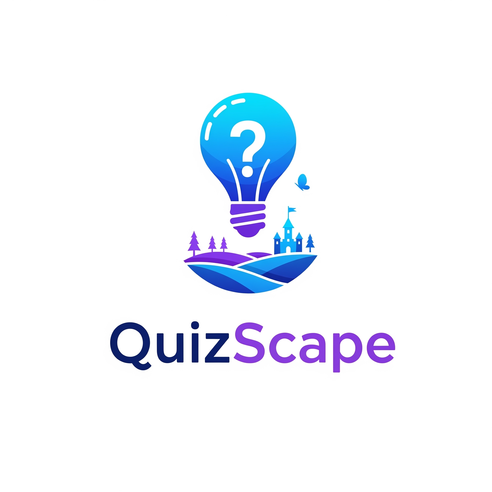 | 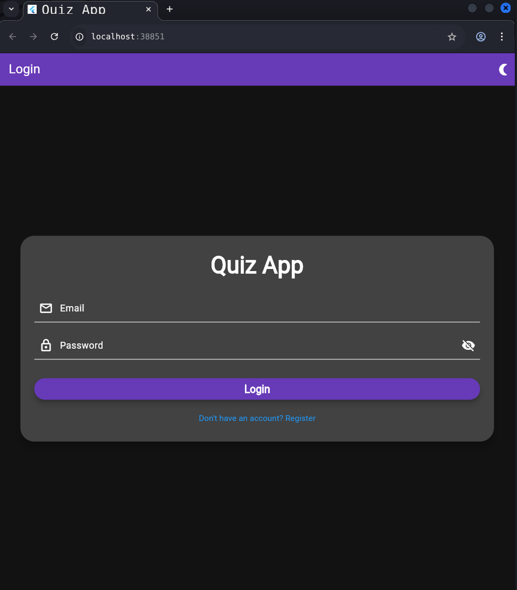 | 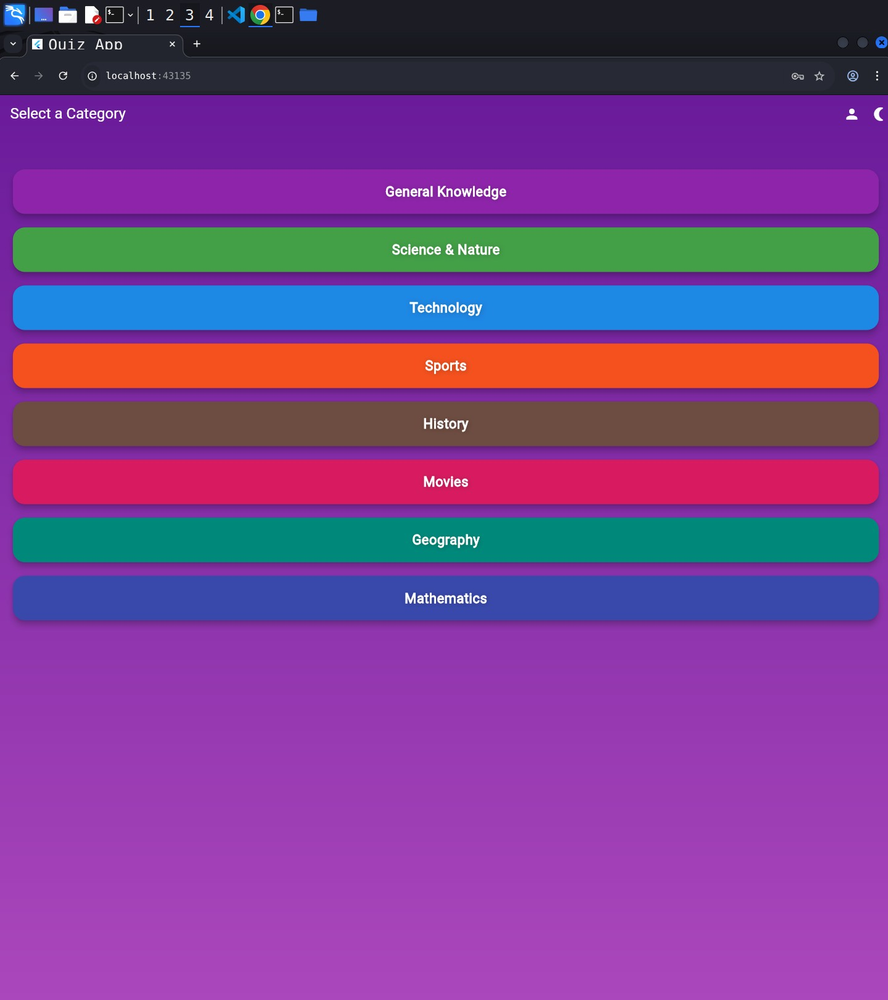 |

| Quiz Screen | Result Screen | Profile Screen |
|-------------|---------------|----------------|
| 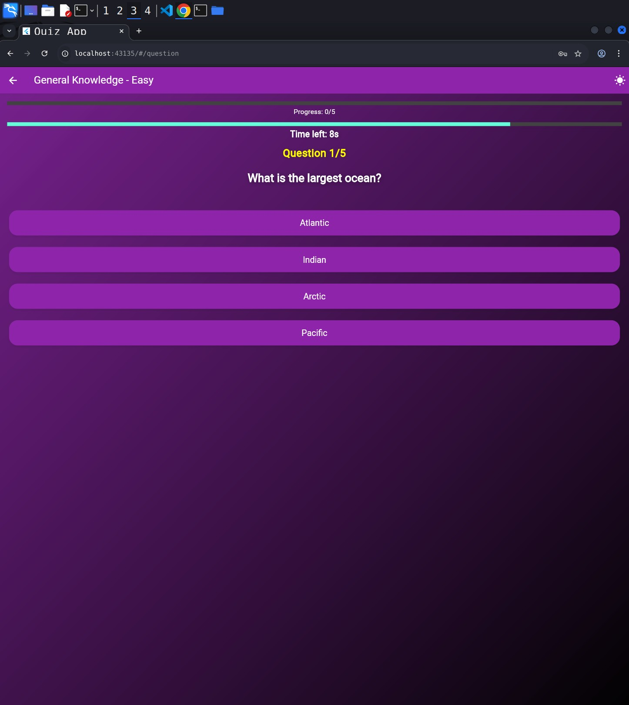 |  | 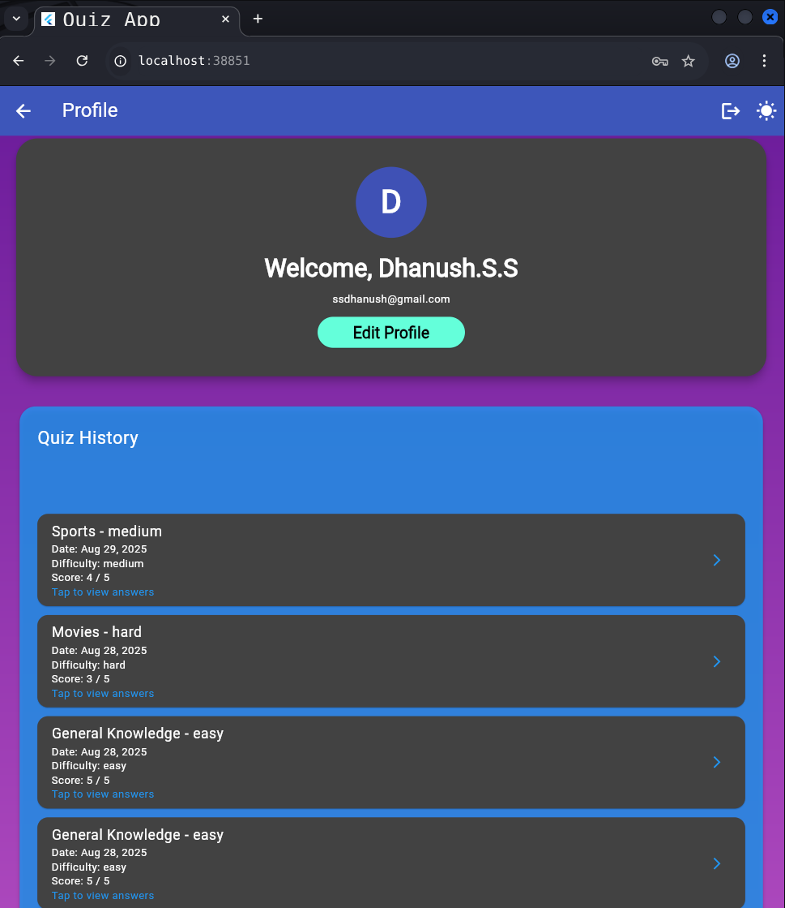 |

| Register Screen | Profile Edit | Home (Categories & Difficulties) |
|-----------------|-------------|-------------------------------|
| 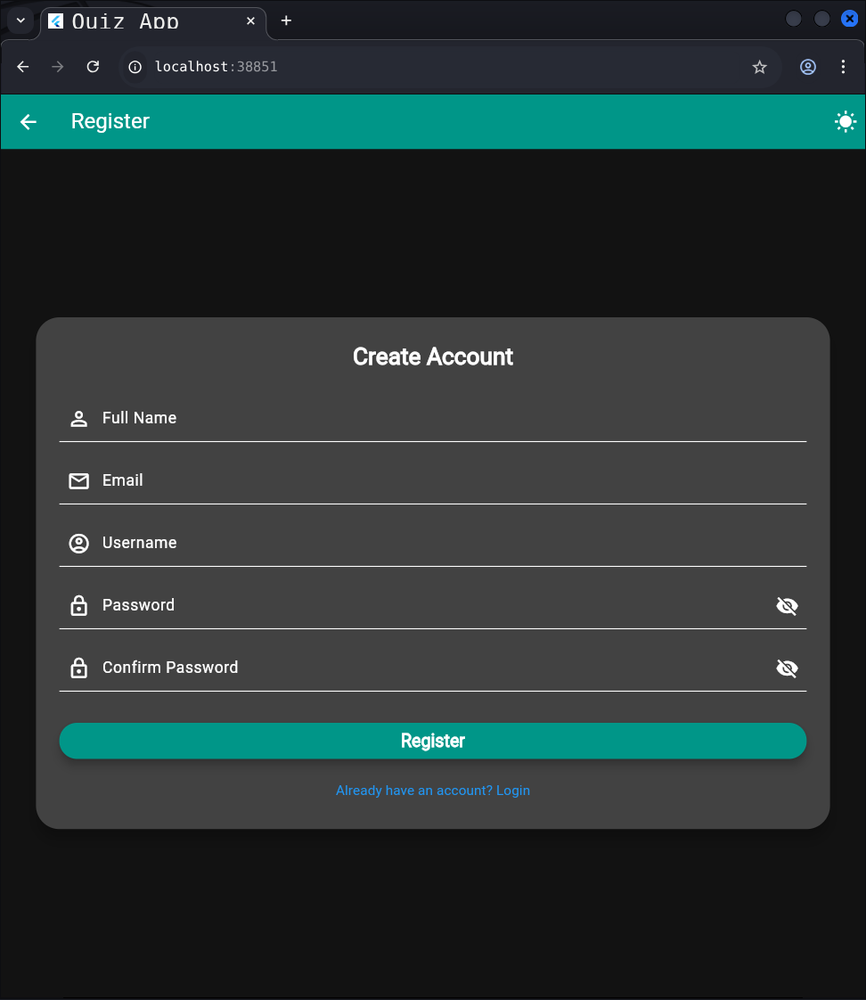 | 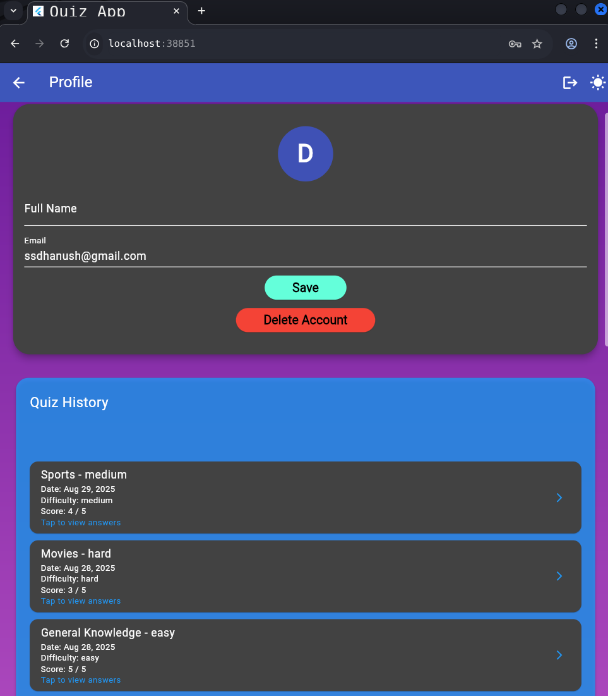 | 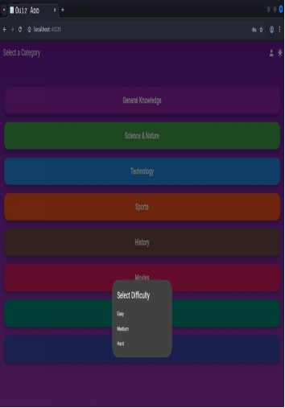 |

| Settings Screen (Light) | Settings Screen (Dark) | Profile Edit (Light) |
|------------------------|-----------------------|---------------------|
|  | 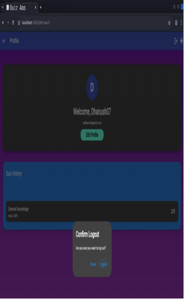 | 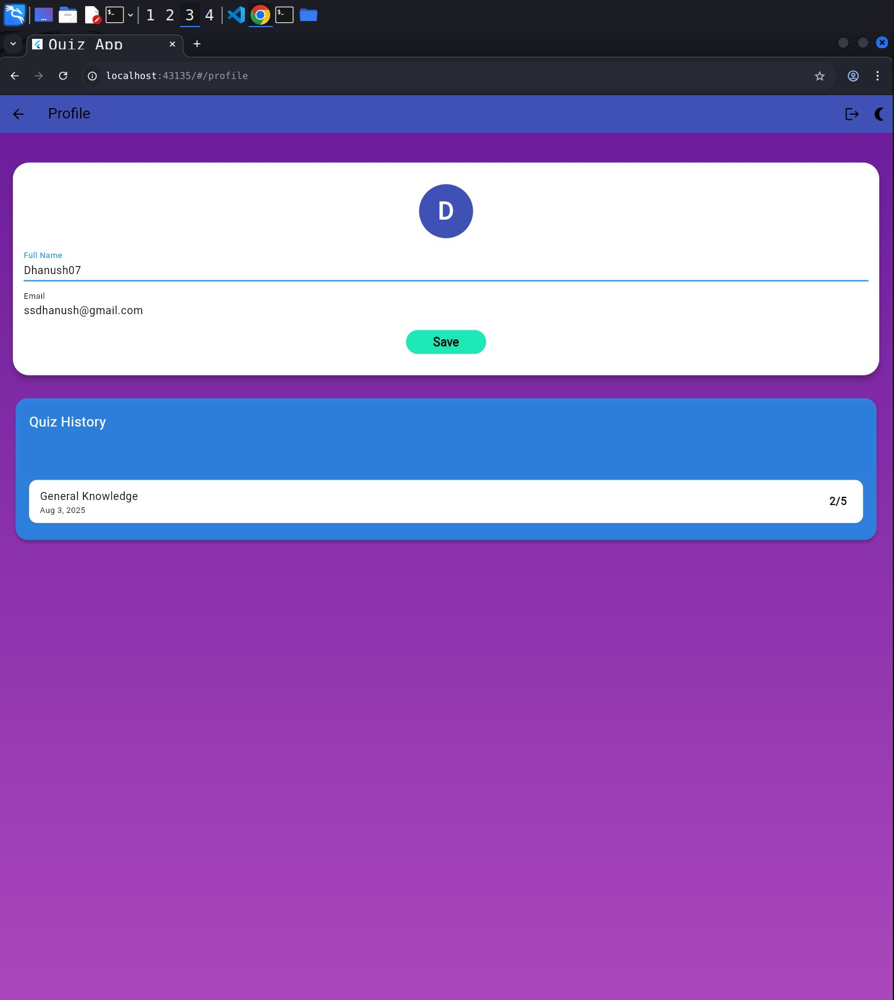 |

---

## 🗺️ Navigation Flow  

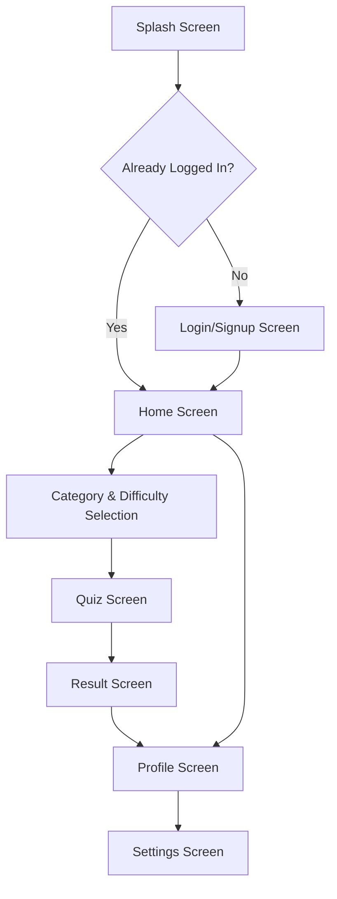

🏛️ **Architecture**

    graph TD
    User --> UI
    UI --> QuizEngine
    QuizEngine --> Supabase
    Supabase --> DataPersistence
    UI --> ProfileModule
    UI --> SettingsModule

    UI Layer: Screens for login, quiz, results, profile, and settings
    Quiz Engine: Handles quiz logic, timer, and scoring
    Supabase: Stores user details, quiz history, and preferences
    Profile & Settings Modules: Personalize user experience

---

### 🧩 Entity–Relationship (ER) Diagram
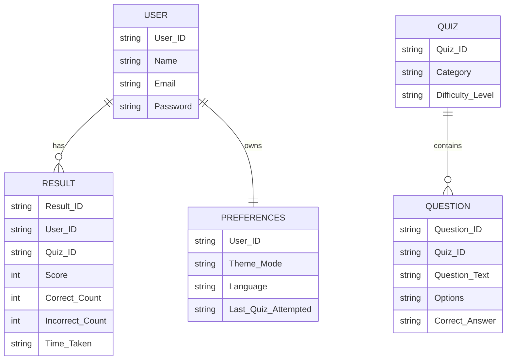

📦 **Technology Stack**

| Layer          | Technology Used         |
| -------------- | ----------------------- |
| **Frontend**   | Flutter (Dart)          |
| **Cloud**      | Supabase (Auth, DB)     |
| **State Mgmt** | Provider                |
| **Styling**    | Google Fonts, Custom UI |
| **Testing**    | flutter_test            |
| **Linting**    | flutter_lints           |


## ♿ Content & Accessibility

- 🌍 **Multilingual Support:** Language selection and full localization for all content.
- 🗣️ **Text-to-Speech & Accessibility:** Improved support for visually impaired users, including TTS for questions and answers.
- 🖼️ **Rich Media Questions:** Support for images, audio, and video in questions and answers for a more engaging experience.

⚙️ **Requirements & Specifications**

    Hardware Requirements

        📱 Android/iOS/Web device with min. 2 GB RAM
        💾 50 MB storage space
        ⚡ Quad-core 1.5 GHz processor
        📺 Display resolution: 720p or higher

    Software Requirements

        🖥️ Android 7.0 (Nougat) or higher / iOS 12+ / Modern browser
        🔧 Flutter SDK
        💻 Visual Studio Code IDE
        🐦 Dart Programming Language
        📚 Dependencies:
            supabase_flutter → Cloud sync & auth
            provider → State management
            intl → Date/time formatting
            google_fonts → Custom fonts
            flutter_dotenv → Environment config


🧪 **Quality Assurance**

        📝 flutter_lints → Enforces clean, consistent Dart coding practices
        🧪 flutter_test → Unit, widget, and integration testing for stability
        ⚡ Code Generation Pipeline → Automates boilerplate code generation
        📊 Performance Profiling → Tracks CPU, memory, and battery usage with Flutter DevTools

## ☁️ Environment Setup

1. Copy `assets/.env.example` to `assets/.env` and fill in your Supabase credentials:
   ```env
   SUPABASE_URL=your-project-url
   SUPABASE_ANON_KEY=your-anon-key
   ```
2. Do **not** commit `assets/.env` to git (see `.gitignore`).
3. Run `flutter pub get` and build for Android, iOS, or Web.


## 🎥 Demonstration

▶️ **[Watch Project Demo](https://drive.google.com/file/d/1V1vqFDM7Ot-_gmYaTbOFgCuZFNmDXwuA/view?usp=sharing)**

📱 Or scan the QR code below:


🏁 **Conclusion**

QuizScape now combines interactive quizzes, cloud sync, and user personalization into a lightweight, cross-platform app.
It showcases strong skills in Flutter, state management, UI/UX, and cloud integration.
The modular design ensures easy scalability and future-readiness 🌱.

🔮 **Future Scope**

    🌍 Add multilingual support
    ☁️ Firebase/other cloud integration for leaderboards
    🤖 AI-driven personalized quiz recommendations
    🏆 Gamification elements (badges, streaks, achievements)

📜 **License**

This project is licensed under the MIT License.
See the LICENSE file for details.
