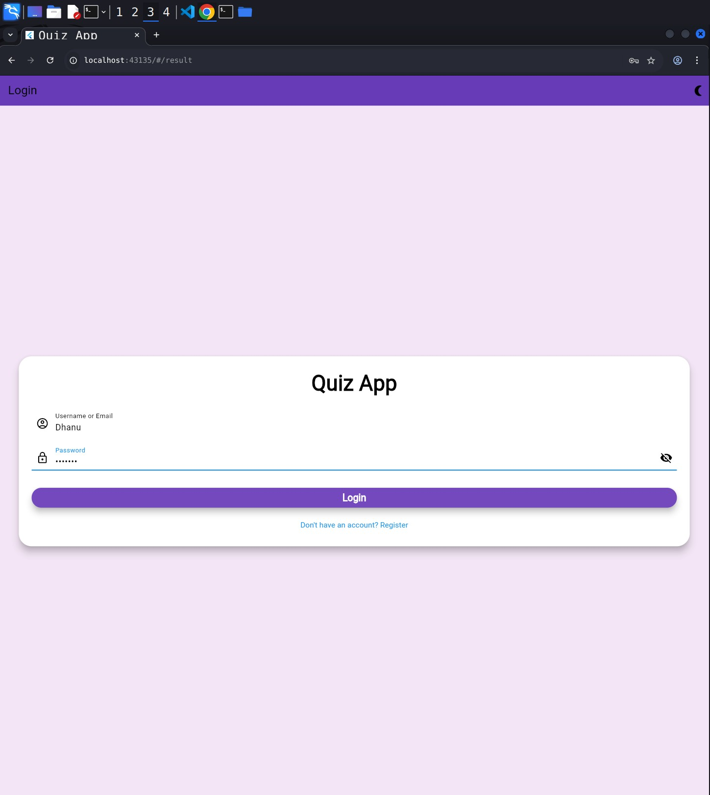
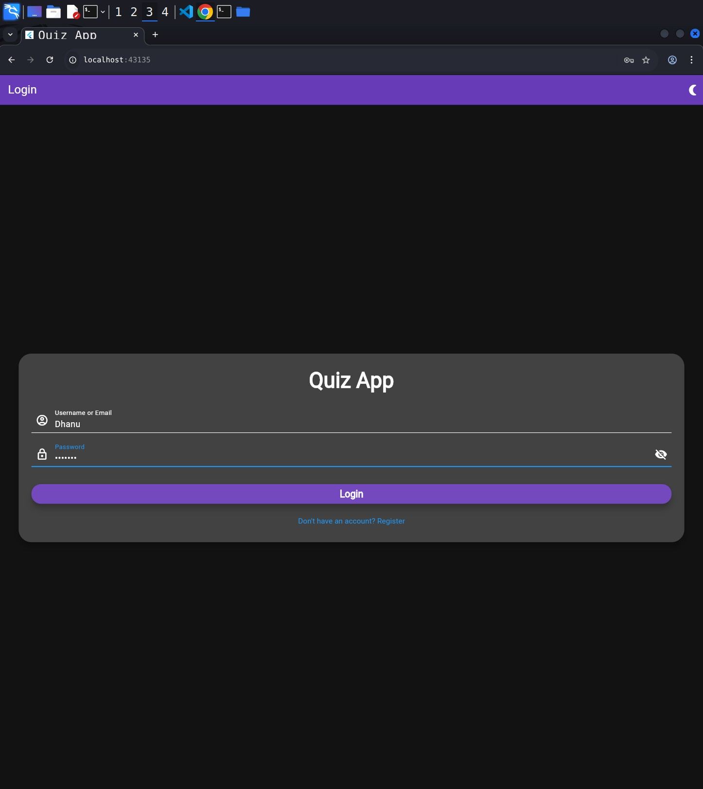
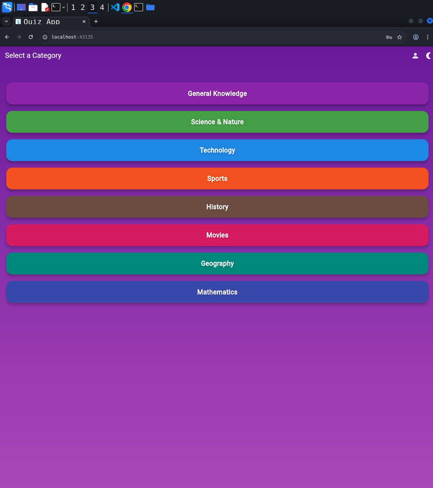
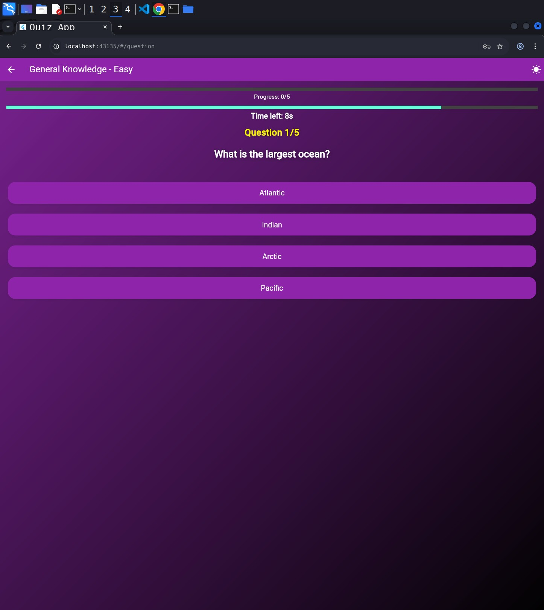
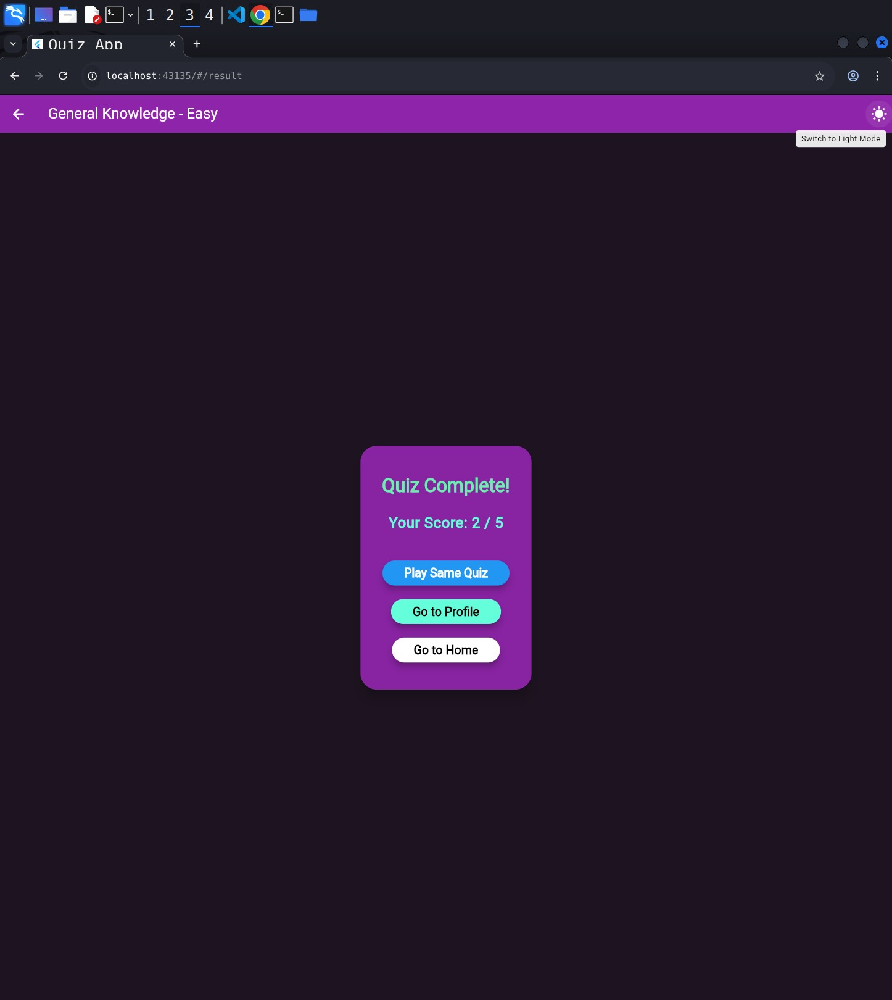
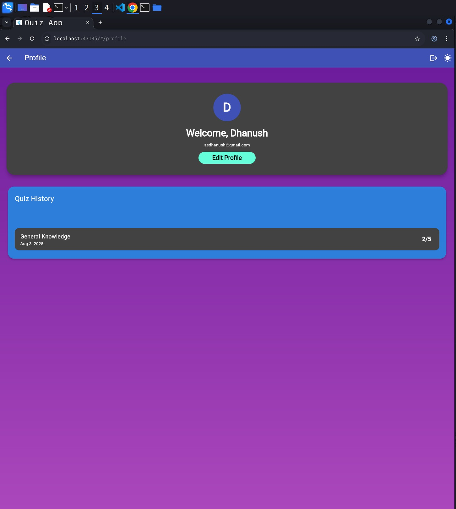
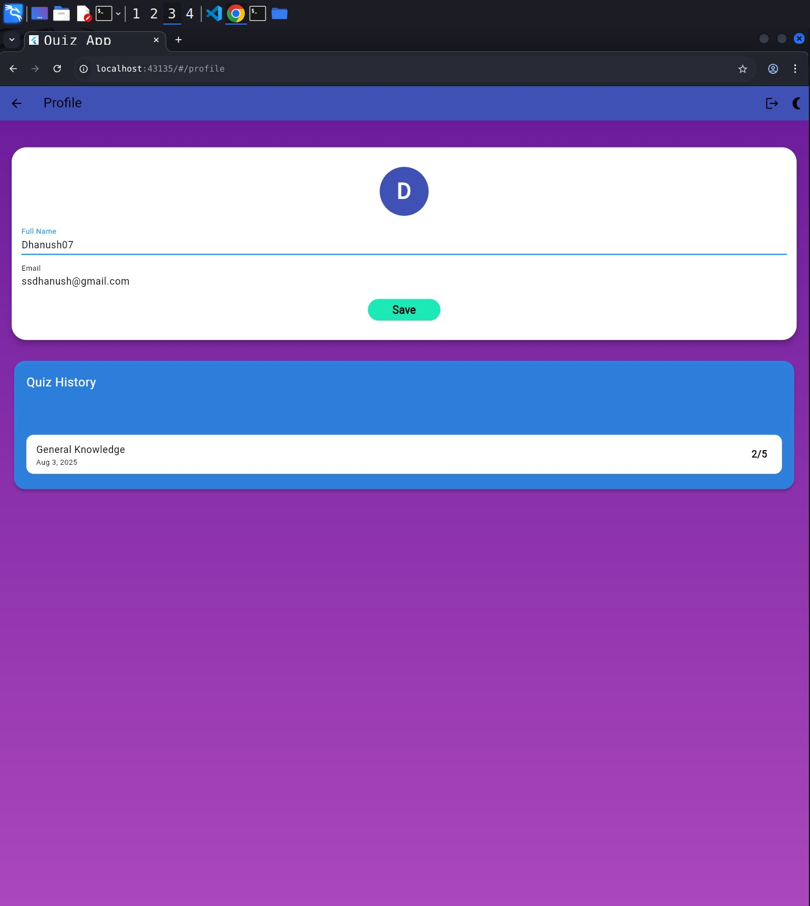

# 📚 QuizScape - A Smart Quiz App  
*An Offline-First Interactive Quiz Application built with Flutter & Dart*  


---

## 📖 Introduction  

**QuizScape** is a lightweight and user-friendly quiz application developed using **Flutter** and **Dart**, designed to provide a seamless and interactive learning experience.  
Unlike many quiz apps that depend heavily on internet access, QuizScape is built with an **offline-first architecture** using **SharedPreferences** for data storage.  

The app allows users to:
- Sign up and log in securely  
- Attempt quizzes across multiple categories and difficulty levels  
- Track progress and scores in real time  
- Customize appearance with Dark/Light mode 🌙☀️  

QuizScape focuses on **accessibility, simplicity, and performance**, ensuring it works smoothly on budget Android devices as well.  

---

## 🚀 Key Features  

- 🔑 **User Authentication**: Secure login and signup with persistent sessions  
- 📂 **Quiz Categories**: Science, GK, Technology, and more  
- 📊 **Difficulty Levels**: Easy, Medium, Hard  
- ⏱️ **Quiz Timer**: Countdown for each quiz attempt  
- 📱 **Offline Functionality**: Works without internet  
- 🌓 **Dark & Light Mode**: User preference saved locally  
- 🏅 **Result & Analytics**: Score summary with feedback  
- 👤 **Profile Dashboard**: Displays user info and progress history  
- 🔒 **Secure Storage**: User data saved with SharedPreferences  

---

## 🖼️ Screenshots  

| Splash Screen | Login Screen | Home Screen |
|---------------|--------------|-------------|
|  |  |  |

| Quiz Screen | Result Screen | Profile Screen |
|-------------|---------------|----------------|
|  |  |  |

| Settings Screen |
|-----------------|
|  |


---

## 🗺️ Navigation Flow  

```mermaid
flowchart TD
    A[Splash Screen] --> B{Already Logged In?}
    B -- Yes --> C[Home Screen]
    B -- No --> D[Login/Signup Screen]
    D --> C
    C --> E[Category & Difficulty Selection]
    E --> F[Quiz Screen]
    F --> G[Result Screen]
    C --> H[Profile Screen]
    C --> I[Settings Screen]

🏛️ Architecture
    graph TD
    User --> UI
    UI --> QuizEngine
    QuizEngine --> SharedPreferences
    SharedPreferences --> DataPersistence
    UI --> ProfileModule
    UI --> SettingsModule

    UI Layer: Screens for login, quiz, results, profile, and settings

    Quiz Engine: Handles quiz logic, timer, and scoring

    SharedPreferences: Stores user details, scores, and preferences

    Profile & Settings Modules: Personalize user experience
---

### 🧩 Entity–Relationship (ER) Diagram
    erDiagram
    USER ||--o{ RESULT : has
    QUIZ ||--o{ QUESTION : contains
    USER ||--|| PREFERENCES : owns

    USER {
        string User_ID
        string Name
        string Email
        string Password
    }
    QUIZ {
        string Quiz_ID
        string Category
        string Difficulty_Level
    }
    QUESTION {
        string Question_ID
        string Quiz_ID
        string Question_Text
        string Options
        string Correct_Answer
    }
    RESULT {
        string Result_ID
        string User_ID
        string Quiz_ID
        int Score
        int Correct_Count
        int Incorrect_Count
        string Time_Taken
    }
    PREFERENCES {
        string User_ID
        string Theme_Mode
        string Language
        string Last_Quiz_Attempted
    }

📦 Technology Stack
    | Layer          | Technology Used         |
    | -------------- | ----------------------- |
    | **Frontend**   | Flutter (Dart)          |
    | **Storage**    | SharedPreferences       |
    | **State Mgmt** | Provider                |
    | **Styling**    | Google Fonts, Custom UI |
    | **Testing**    | flutter\_test           |
    | **Linting**    | flutter\_lints          |

⚙️ Requirements & Specifications

    Hardware Requirements

        📱 Android Smartphone with min. 2 GB RAM

        💾 50 MB storage space

        ⚡ Quad-core 1.5 GHz processor

        📺 Display resolution: 720p or higher

    Software Requirements

        🖥️ Android 7.0 (Nougat) or higher

        🔧 Flutter SDK

        💻 Visual Studio Code IDE

        🐦 Dart Programming Language

        📚 Dependencies:

            shared_preferences → Local storage

            provider → State management

            intl → Date/time formatting

            google_fonts → Custom fonts


🧪 Quality Assurance

        📝 flutter_lints → Enforces clean, consistent Dart coding practices

        🧪 flutter_test → Unit, widget, and integration testing for stability

        ⚡ Code Generation Pipeline → Automates boilerplate code generation

        📊 Performance Profiling → Tracks CPU, memory, and battery usage with Flutter DevTools

## 🎥 Demonstration  

        ▶️ **[Watch Project Demo](https://drive.google.com/drive/folders/1Yzxn-CuKI7NZ6O451vO_tT8ok0fpccWo?usp=drive_link)**
 
        📱 Or scan the QR code below:  

        


🏁 Conclusion

        QuizScape successfully combines interactive quizzes, offline-first functionality, and user personalization into a lightweight mobile app.
        It showcases strong skills in Flutter development, state management, UI/UX design, and local storage handling.
        The app’s modular design ensures easy scalability, making it future-ready 🌱.

🔮 Future Scope

    🌍 Add multilingual support

    ☁️ Firebase integration for leaderboards and cloud sync

    🤖 AI-driven personalized quiz recommendations

    🏆 Gamification elements (badges, streaks, achievements)

📜 License

    This project is licensed under the MIT License.
    See the LICENSE file for details.


